# 🗄️ Схема базы данных

Полная документация структуры базы данных Exodus DayZ Shop.

---

## 📑 Содержание

- [Обзор](#обзор)
- [ER-диаграмма](#er-диаграмма)
- [Основные таблицы](#основные-таблицы)
- [Таблицы заказов](#таблицы-заказов)
- [Таблицы платежей](#таблицы-платежей)
- [Таблицы геймификации](#таблицы-геймификации)
- [Таблицы акций и скидок](#таблицы-акций-и-скидок)
- [Таблицы коммуникаций](#таблицы-коммуникаций)
- [Таблицы аналитики](#таблицы-аналитики)
- [Таблицы администрирования](#таблицы-администрирования)
- [Функции и триггеры](#функции-и-триггеры)
- [RLS политики](#rls-политики)

---

## Обзор

| Категория | Количество таблиц |
|-----------|-------------------|
| Основные | 5 |
| Заказы | 3 |
| Платежи | 3 |
| Геймификация | 9 |
| Акции и скидки | 5 |
| Коммуникации | 8 |
| Аналитика | 6 |
| Администрирование | 9 |
| **Всего** | **48** |

---

## ER-диаграмма

```mermaid
erDiagram
    profiles ||--o{ orders : "has"
    profiles ||--o{ cart_items : "has"
    profiles ||--o{ wishlist : "has"
    profiles ||--o{ balance_transactions : "has"
    profiles ||--o{ referrals : "referred"
    profiles ||--o{ user_achievements : "earned"
    profiles ||--o{ reviews : "wrote"
    profiles ||--o{ daily_rewards : "claims"
    profiles ||--o{ fortune_wheel_spins : "spins"
    profiles ||--o{ price_alerts : "sets"
    profiles ||--o{ notifications : "receives"
    profiles ||--o{ support_tickets : "creates"
    profiles ||--o{ viewed_products : "views"
    
    products ||--o{ order_items : "in"
    products ||--o{ cart_items : "in"
    products ||--o{ wishlist : "in"
    products ||--o{ reviews : "has"
    products ||--o{ product_images : "has"
    products ||--o{ product_inventory : "has"
    products ||--o{ promotions : "has"
    products ||--o{ price_history : "has"
    
    orders ||--o{ order_items : "contains"
    
    achievements ||--o{ user_achievements : "unlocked"
    
    promo_codes ||--o{ promo_code_uses : "used"
    promo_codes ||--o{ birthday_coupons : "generated"
    
    support_tickets ||--o{ ticket_messages : "has"
    
    product_bundles ||--o{ bundle_items : "contains"
    
    ab_tests ||--o{ ab_test_results : "has"
    
    email_campaigns ||--o{ notification_logs : "creates"
```



---

## Основные таблицы

### profiles

Профили пользователей (расширение auth.users).

| Колонка | Тип | Описание |
|---------|-----|----------|
| `id` | uuid | PK, ссылка на auth.users |
| `username` | text | Имя пользователя |
| `steam_id` | text | Steam ID (17 цифр) |
| `discord_id` | text | Discord ID |
| `telegram_chat_id` | bigint | Telegram Chat ID |
| `balance` | numeric | Баланс аккаунта (₴) |
| `total_spent` | numeric | Всего потрачено (₴) |
| `is_veteran` | boolean | Статус ветерана сервера |
| `is_banned` | boolean | Заблокирован |
| `banned_at` | timestamptz | Дата блокировки |
| `banned_reason` | text | Причина блокировки |
| `birthday` | date | День рождения (для скидок) |
| `avatar_url` | text | URL аватара |
| `referral_code` | text | Уникальный реферальный код |
| `referred_by` | text | Код пригласившего |
| `email_news_enabled` | boolean | Подписка на новости |
| `email_promotions_enabled` | boolean | Подписка на акции |
| `email_order_updates_enabled` | boolean | Уведомления о заказах |
| `created_at` | timestamptz | Дата регистрации |
| `updated_at` | timestamptz | Дата обновления |

**Триггеры:**
- `generate_referral_code` — генерация уникального кода при создании
- `generate_birthday_promo` — генерация промокода на день рождения

### products

Товары магазина.

| Колонка | Тип | Описание |
|---------|-----|----------|
| `id` | text | PK, уникальный slug товара |
| `name` | text | Название товара |
| `description` | text | Описание |
| `price` | numeric | Цена (₴) |
| `image` | text | URL главного изображения |
| `category` | text | Категория товара |
| `created_at` | timestamptz | Дата создания |

**Категории:** `vehicles`, `containers`, `building`, `parts`, `vip`

### user_roles

Роли пользователей.

| Колонка | Тип | Описание |
|---------|-----|----------|
| `id` | uuid | PK |
| `user_id` | uuid | FK → profiles.id |
| `role` | app_role | Роль (enum) |

**Enum app_role:**
| Роль | Описание | Права |
|------|----------|-------|
| `user` | Обычный пользователь | Покупки, профиль |
| `veteran` | Ветеран сервера | + Скидки ветерана |
| `moderator` | Модератор | + Просмотр тикетов |
| `admin` | Администратор | + Управление контентом |
| `super_admin` | Супер-админ | Полный доступ |

### loyalty_levels

Уровни программы лояльности.

| Колонка | Тип | Описание |
|---------|-----|----------|
| `id` | uuid | PK |
| `name` | text | Название уровня |
| `min_spent` | numeric | Мин. сумма покупок (₴) |
| `discount_percent` | numeric | Скидка % |
| `cashback_percent` | numeric | Кэшбек % |
| `color` | text | Цвет бейджа (hex) |
| `icon` | text | Иконка (emoji) |
| `created_at` | timestamptz | Дата создания |

**Уровни по умолчанию:**
| Уровень | Min Spent | Скидка | Кэшбек |
|---------|-----------|--------|--------|
| Bronze | 0₴ | 0% | 1% |
| Silver | 500₴ | 2% | 2% |
| Gold | 2000₴ | 5% | 3% |
| Platinum | 5000₴ | 7% | 5% |
| Diamond | 10000₴ | 10% | 7% |

### product_images

Галерея изображений товаров.

| Колонка | Тип | Описание |
|---------|-----|----------|
| `id` | uuid | PK |
| `product_id` | text | ID товара |
| `image_url` | text | URL изображения |
| `is_primary` | boolean | Главное изображение |
| `display_order` | integer | Порядок отображения |
| `created_at` | timestamptz | Дата добавления |

---

## Таблицы заказов

### orders

Заказы пользователей.

| Колонка | Тип | Описание |
|---------|-----|----------|
| `id` | uuid | PK |
| `user_id` | uuid | FK → profiles.id |
| `steam_id` | text | Steam ID для доставки |
| `total_amount` | numeric | Сумма до скидки |
| `discount_amount` | numeric | Размер скидки |
| `final_amount` | numeric | Итоговая сумма |
| `payment_method` | text | Способ оплаты |
| `payment_status` | text | Статус оплаты |
| `created_at` | timestamptz | Дата создания |

**Способы оплаты:** `balance`, `wayforpay`, `nowpayments`

**Статусы:**
| Статус | Описание |
|--------|----------|
| `pending` | Ожидает оплаты |
| `completed` | Оплачен |
| `cancelled` | Отменён |
| `refunded` | Возврат |
| `delivered` | Доставлен |

**Триггеры:**
- `process_order_completion` — начисление кэшбека, уведомления
- `process_referral_bonus` — бонус за реферала

### order_items

Позиции заказа.

| Колонка | Тип | Описание |
|---------|-----|----------|
| `id` | uuid | PK |
| `order_id` | uuid | FK → orders.id |
| `product_id` | text | ID товара |
| `product_name` | text | Название (snapshot) |
| `product_price` | numeric | Цена (snapshot) |
| `quantity` | integer | Количество |
| `created_at` | timestamptz | Дата создания |

### cart_items

Корзина пользователя.

| Колонка | Тип | Описание |
|---------|-----|----------|
| `id` | uuid | PK |
| `user_id` | uuid | FK → profiles.id |
| `product_id` | text | ID товара |
| `product_name` | text | Название |
| `product_price` | numeric | Цена |
| `quantity` | integer | Количество |
| `added_at` | timestamptz | Дата добавления |

**Триггер:** `populate_cart_item_details` — заполнение данных товара

---

## Таблицы платежей

### balance_transactions

Транзакции баланса.

| Колонка | Тип | Описание |
|---------|-----|----------|
| `id` | uuid | PK |
| `user_id` | uuid | FK → profiles.id |
| `amount` | numeric | Сумма транзакции |
| `type` | text | Тип операции |
| `description` | text | Описание |
| `payment_method` | text | Способ оплаты |
| `status` | text | Статус |
| `created_at` | timestamptz | Дата |

**Типы транзакций:**
| Тип | Описание |
|-----|----------|
| `topup` | Пополнение баланса |
| `purchase` | Покупка |
| `refund` | Возврат |
| `bonus` | Бонус |
| `cashback` | Кэшбек |
| `referral_bonus` | Реферальный бонус |
| `daily_bonus` | Ежедневный бонус |
| `fortune_wheel` | Выигрыш колеса |

### promo_codes

Промокоды.

| Колонка | Тип | Описание |
|---------|-----|----------|
| `id` | uuid | PK |
| `code` | text | Код (уникальный, uppercase) |
| `discount_percent` | numeric | Скидка % |
| `is_active` | boolean | Активен |
| `valid_from` | timestamptz | Начало действия |
| `valid_until` | timestamptz | Конец действия |
| `max_uses` | integer | Макс. использований |
| `current_uses` | integer | Текущих использований |
| `min_order_amount` | numeric | Мин. сумма заказа |
| `created_at` | timestamptz | Дата создания |

### promo_code_uses

Использования промокодов.

| Колонка | Тип | Описание |
|---------|-----|----------|
| `id` | uuid | PK |
| `promo_code_id` | uuid | FK → promo_codes.id |
| `user_id` | uuid | FK → profiles.id |
| `order_id` | uuid | FK → orders.id |
| `used_at` | timestamptz | Дата использования |

**Триггер:** `notify_promo_code_use` — уведомление об использовании

---

## Таблицы геймификации

### achievements

Достижения.

| Колонка | Тип | Описание |
|---------|-----|----------|
| `id` | uuid | PK |
| `name` | text | Название |
| `description` | text | Описание |
| `icon` | text | Иконка (emoji) |
| `requirement_type` | text | Тип условия |
| `requirement_value` | integer | Значение условия |
| `reward_balance` | numeric | Награда (₴) |
| `created_at` | timestamptz | Дата создания |

**Типы условий:**
| Тип | Описание |
|-----|----------|
| `orders_count` | Количество заказов |
| `total_spent` | Сумма покупок |
| `referrals_count` | Количество рефералов |
| `reviews_count` | Количество отзывов |
| `daily_streak` | Серия дней |

### user_achievements

Полученные достижения.

| Колонка | Тип | Описание |
|---------|-----|----------|
| `id` | uuid | PK |
| `user_id` | uuid | FK → profiles.id |
| `achievement_id` | uuid | FK → achievements.id |
| `unlocked_at` | timestamptz | Дата получения |

**Триггер:** `notify_achievement_unlock` — уведомление и начисление награды

### referrals

Рефералы.

| Колонка | Тип | Описание |
|---------|-----|----------|
| `id` | uuid | PK |
| `referrer_id` | uuid | ID пригласившего |
| `referred_id` | uuid | ID приглашённого |
| `referral_code` | text | Использованный код |
| `bonus_given` | boolean | Бонус выдан |
| `created_at` | timestamptz | Дата |

**Бонус:** 50₴ обоим после первого заказа приглашённого

### daily_rewards

Ежедневные награды.

| Колонка | Тип | Описание |
|---------|-----|----------|
| `id` | uuid | PK |
| `user_id` | uuid | FK → profiles.id (unique) |
| `last_claim` | timestamptz | Последний клейм |
| `streak` | integer | Серия дней (1-7) |
| `total_claimed` | numeric | Всего получено |
| `created_at` | timestamptz | Дата создания |

**Бонусы по дням:**
| День | Бонус |
|------|-------|
| 1 | 5₴ |
| 2 | 7₴ |
| 3 | 10₴ |
| 4 | 15₴ |
| 5 | 20₴ |
| 6 | 30₴ |
| 7+ | 50₴ |

### fortune_wheel_spins

Спины колеса фортуны.

| Колонка | Тип | Описание |
|---------|-----|----------|
| `id` | uuid | PK |
| `user_id` | uuid | FK → profiles.id |
| `prize_type` | text | Тип приза |
| `prize_value` | numeric | Значение приза |
| `spun_at` | timestamptz | Дата спина |

**Призы:**
| Шанс | Приз |
|------|------|
| 5% | 100₴ |
| 10% | 50₴ |
| 15% | 25₴ |
| 20% | 10₴ |
| 15% | 5₴ |
| 15% | -20% скидка |
| 10% | -10% скидка |
| 10% | Ничего |

**Ограничение:** 1 спин в 7 дней

### wishlist

Список желаний.

| Колонка | Тип | Описание |
|---------|-----|----------|
| `id` | uuid | PK |
| `user_id` | uuid | FK → profiles.id |
| `product_id` | text | ID товара |
| `created_at` | timestamptz | Дата добавления |

### reviews

Отзывы о товарах.

| Колонка | Тип | Описание |
|---------|-----|----------|
| `id` | uuid | PK |
| `user_id` | uuid | FK → profiles.id |
| `product_id` | text | ID товара |
| `rating` | integer | Оценка (1-5) |
| `comment` | text | Комментарий |
| `created_at` | timestamptz | Дата создания |
| `updated_at` | timestamptz | Дата обновления |

### price_alerts

Алерты о снижении цены.

| Колонка | Тип | Описание |
|---------|-----|----------|
| `id` | uuid | PK |
| `user_id` | uuid | FK → profiles.id |
| `product_id` | text | ID товара |
| `target_price` | numeric | Целевая цена |
| `is_active` | boolean | Активен |
| `notified_at` | timestamptz | Дата уведомления |
| `created_at` | timestamptz | Дата создания |

### birthday_coupons

Купоны на день рождения.

| Колонка | Тип | Описание |
|---------|-----|----------|
| `id` | uuid | PK |
| `user_id` | uuid | FK → profiles.id |
| `promo_code_id` | uuid | FK → promo_codes.id |
| `year` | integer | Год выдачи |
| `sent_at` | timestamptz | Дата отправки |
| `used_at` | timestamptz | Дата использования |
| `created_at` | timestamptz | Дата создания |

---

## Таблицы акций и скидок

### promotions

Акции на товары.

| Колонка | Тип | Описание |
|---------|-----|----------|
| `id` | uuid | PK |
| `product_id` | text | ID товара |
| `discount_percent` | numeric | Скидка % |
| `start_date` | timestamptz | Начало акции |
| `end_date` | timestamptz | Конец акции |
| `is_active` | boolean | Активна |
| `is_flash_sale` | boolean | Флеш-распродажа |
| `flash_title` | text | Заголовок флеша |
| `created_at` | timestamptz | Дата создания |

### flash_sales

Флеш-распродажи (групповые).

| Колонка | Тип | Описание |
|---------|-----|----------|
| `id` | uuid | PK |
| `title` | text | Название |
| `description` | text | Описание |
| `discount_percent` | numeric | Скидка % |
| `product_ids` | text[] | Массив ID товаров |
| `start_date` | timestamptz | Начало |
| `end_date` | timestamptz | Конец |
| `max_uses` | integer | Макс. использований |
| `current_uses` | integer | Текущих |
| `is_active` | boolean | Активна |
| `created_at` | timestamptz | Дата создания |

### product_bundles

Наборы товаров.

| Колонка | Тип | Описание |
|---------|-----|----------|
| `id` | uuid | PK |
| `name` | text | Название набора |
| `description` | text | Описание |
| `bundle_price` | numeric | Цена набора |
| `image` | text | URL изображения |
| `start_date` | timestamptz | Начало действия |
| `end_date` | timestamptz | Конец действия |
| `is_active` | boolean | Активен |
| `created_at` | timestamptz | Дата создания |
| `updated_at` | timestamptz | Дата обновления |

### bundle_items

Товары в наборе.

| Колонка | Тип | Описание |
|---------|-----|----------|
| `id` | uuid | PK |
| `bundle_id` | uuid | FK → product_bundles.id |
| `product_id` | text | ID товара |
| `quantity` | integer | Количество |
| `created_at` | timestamptz | Дата добавления |

### homepage_banners

Баннеры главной страницы.

| Колонка | Тип | Описание |
|---------|-----|----------|
| `id` | uuid | PK |
| `title` | text | Заголовок |
| `subtitle` | text | Подзаголовок |
| `image_url` | text | URL изображения |
| `link_url` | text | URL ссылки |
| `link_text` | text | Текст кнопки |
| `badge_text` | text | Текст бейджа |
| `badge_color` | text | Цвет бейджа |
| `background_gradient` | text | CSS градиент фона |
| `display_order` | integer | Порядок |
| `start_date` | timestamptz | Начало показа |
| `end_date` | timestamptz | Конец показа |
| `is_active` | boolean | Активен |
| `created_at` | timestamptz | Дата создания |
| `updated_at` | timestamptz | Дата обновления |

---

## Таблицы коммуникаций

### notifications

Уведомления пользователей (in-app).

| Колонка | Тип | Описание |
|---------|-----|----------|
| `id` | uuid | PK |
| `user_id` | uuid | FK → profiles.id |
| `type` | text | Тип уведомления |
| `title` | text | Заголовок |
| `message` | text | Сообщение |
| `data` | jsonb | Дополнительные данные |
| `is_read` | boolean | Прочитано |
| `created_at` | timestamptz | Дата создания |

**Типы:**
- `order_status` — статус заказа
- `achievement` — достижение
- `promo_code` — промокод
- `birthday` — день рождения
- `reward` — награда
- `referral_bonus` — реферальный бонус
- `system` — системное

### support_tickets

Тикеты поддержки.

| Колонка | Тип | Описание |
|---------|-----|----------|
| `id` | uuid | PK |
| `user_id` | uuid | FK → profiles.id |
| `subject` | text | Тема |
| `status` | text | Статус |
| `priority` | text | Приоритет |
| `created_at` | timestamptz | Дата создания |
| `updated_at` | timestamptz | Дата обновления |
| `closed_at` | timestamptz | Дата закрытия |

**Статусы:** `open`, `in_progress`, `waiting`, `resolved`, `closed`
**Приоритеты:** `low`, `medium`, `high`, `urgent`

### ticket_messages

Сообщения в тикетах.

| Колонка | Тип | Описание |
|---------|-----|----------|
| `id` | uuid | PK |
| `ticket_id` | uuid | FK → support_tickets.id |
| `sender_id` | uuid | ID отправителя |
| `message` | text | Сообщение |
| `is_admin` | boolean | От админа |
| `created_at` | timestamptz | Дата |

### broadcast_messages

Массовые рассылки.

| Колонка | Тип | Описание |
|---------|-----|----------|
| `id` | uuid | PK |
| `admin_id` | uuid | ID админа |
| `title` | text | Заголовок |
| `message` | text | Сообщение |
| `type` | text | Тип (email/push/both) |
| `target_audience` | text | Целевая аудитория |
| `status` | text | Статус |
| `sent_count` | integer | Отправлено |
| `failed_count` | integer | Ошибок |
| `created_at` | timestamptz | Дата создания |
| `sent_at` | timestamptz | Дата отправки |

### news_posts

Новости.

| Колонка | Тип | Описание |
|---------|-----|----------|
| `id` | uuid | PK |
| `author_id` | uuid | ID автора |
| `title` | text | Заголовок |
| `content` | text | Контент (markdown) |
| `summary` | text | Краткое описание |
| `image` | text | URL изображения |
| `category` | text | Категория |
| `is_published` | boolean | Опубликовано |
| `is_pinned` | boolean | Закреплено |
| `published_at` | timestamptz | Дата публикации |
| `created_at` | timestamptz | Дата создания |
| `updated_at` | timestamptz | Дата обновления |

**Категории:** `update`, `event`, `sale`, `announcement`

### telegram_users

Привязка Telegram.

| Колонка | Тип | Описание |
|---------|-----|----------|
| `id` | uuid | PK |
| `telegram_id` | bigint | Telegram ID (unique) |
| `telegram_username` | text | @username |
| `user_id` | uuid | FK → profiles.id |
| `verification_code` | text | Код верификации |
| `is_verified` | boolean | Верифицирован |
| `created_at` | timestamptz | Дата создания |

### push_subscriptions

Push подписки (Web Push).

| Колонка | Тип | Описание |
|---------|-----|----------|
| `id` | uuid | PK |
| `user_id` | uuid | FK → profiles.id |
| `endpoint` | text | Push endpoint |
| `p256dh` | text | Публичный ключ |
| `auth` | text | Auth ключ |
| `created_at` | timestamptz | Дата создания |

### message_templates

Шаблоны сообщений.

| Колонка | Тип | Описание |
|---------|-----|----------|
| `id` | uuid | PK |
| `name` | text | Название шаблона |
| `type` | text | Тип (email/push/telegram) |
| `subject` | text | Тема (для email) |
| `body` | text | Тело сообщения |
| `created_at` | timestamptz | Дата создания |
| `updated_at` | timestamptz | Дата обновления |

---

## Таблицы аналитики

### product_views

Просмотры товаров.

| Колонка | Тип | Описание |
|---------|-----|----------|
| `id` | uuid | PK |
| `product_id` | text | ID товара |
| `user_id` | uuid | ID пользователя (опц.) |
| `session_id` | text | ID сессии |
| `source` | text | Источник перехода |
| `viewed_at` | timestamptz | Дата просмотра |

### product_clicks

Клики по товарам.

| Колонка | Тип | Описание |
|---------|-----|----------|
| `id` | uuid | PK |
| `product_id` | text | ID товара |
| `user_id` | uuid | ID пользователя |
| `action` | text | Тип действия |
| `created_at` | timestamptz | Дата |

**Действия:** `view`, `add_to_cart`, `add_to_wishlist`, `compare`, `buy`

### viewed_products

История просмотров пользователя.

| Колонка | Тип | Описание |
|---------|-----|----------|
| `id` | uuid | PK |
| `user_id` | uuid | FK → profiles.id |
| `product_id` | text | ID товара |
| `viewed_at` | timestamptz | Дата просмотра |

### price_history

История изменения цен.

| Колонка | Тип | Описание |
|---------|-----|----------|
| `id` | uuid | PK |
| `product_id` | text | ID товара |
| `old_price` | numeric | Старая цена |
| `new_price` | numeric | Новая цена |
| `changed_by` | uuid | ID админа |
| `changed_at` | timestamptz | Дата изменения |

### ab_tests

A/B тесты.

| Колонка | Тип | Описание |
|---------|-----|----------|
| `id` | uuid | PK |
| `name` | text | Название теста |
| `description` | text | Описание |
| `variant_a` | jsonb | Вариант A |
| `variant_b` | jsonb | Вариант B |
| `traffic_split` | numeric | % трафика на B |
| `start_date` | timestamptz | Начало |
| `end_date` | timestamptz | Конец |
| `is_active` | boolean | Активен |
| `created_at` | timestamptz | Дата создания |

### ab_test_results

Результаты A/B тестов.

| Колонка | Тип | Описание |
|---------|-----|----------|
| `id` | uuid | PK |
| `test_id` | uuid | FK → ab_tests.id |
| `user_id` | uuid | FK → profiles.id |
| `session_id` | text | ID сессии |
| `variant` | text | Показанный вариант |
| `converted` | boolean | Конверсия |
| `conversion_value` | numeric | Значение конверсии |
| `created_at` | timestamptz | Дата |

---

## Таблицы администрирования

### admin_settings

Настройки системы.

| Колонка | Тип | Описание |
|---------|-----|----------|
| `id` | uuid | PK |
| `key` | text | Ключ настройки (unique) |
| `value` | text | Значение |
| `description` | text | Описание |
| `is_encrypted` | boolean | Зашифровано |
| `created_at` | timestamptz | Дата создания |
| `updated_at` | timestamptz | Дата обновления |

**Примеры настроек:**
| Ключ | Описание |
|------|----------|
| `maintenance_mode` | Режим обслуживания |
| `referral_bonus` | Размер реферального бонуса |
| `min_order_amount` | Минимальная сумма заказа |
| `max_cart_items` | Макс. товаров в корзине |

### admin_audit_logs

Аудит действий админов.

| Колонка | Тип | Описание |
|---------|-----|----------|
| `id` | uuid | PK |
| `admin_id` | uuid | ID админа |
| `action` | text | Действие |
| `target_type` | text | Тип объекта |
| `target_id` | text | ID объекта |
| `old_value` | jsonb | Старое значение |
| `new_value` | jsonb | Новое значение |
| `ip_address` | text | IP адрес |
| `created_at` | timestamptz | Дата |

### cron_jobs

Cron задачи.

| Колонка | Тип | Описание |
|---------|-----|----------|
| `id` | uuid | PK |
| `name` | text | Название |
| `description` | text | Описание |
| `function_name` | text | Имя Edge Function |
| `schedule` | text | Расписание (cron) |
| `is_enabled` | boolean | Включена |
| `last_run_at` | timestamptz | Последний запуск |
| `last_status` | text | Статус |
| `created_at` | timestamptz | Дата создания |
| `updated_at` | timestamptz | Дата обновления |

### product_inventory

Инвентарь товаров.

| Колонка | Тип | Описание |
|---------|-----|----------|
| `id` | uuid | PK |
| `product_id` | text | ID товара (unique) |
| `stock_quantity` | integer | Количество на складе |
| `is_unlimited` | boolean | Безлимитный |
| `low_stock_threshold` | integer | Порог низкого остатка |
| `created_at` | timestamptz | Дата создания |
| `updated_at` | timestamptz | Дата обновления |

### inventory_logs

Логи инвентаря.

| Колонка | Тип | Описание |
|---------|-----|----------|
| `id` | uuid | PK |
| `product_id` | text | ID товара |
| `change_amount` | integer | Изменение количества |
| `reason` | text | Причина |
| `order_id` | uuid | FK → orders.id |
| `admin_id` | uuid | ID админа |
| `created_at` | timestamptz | Дата |

### edge_function_logs

Логи Edge Functions.

| Колонка | Тип | Описание |
|---------|-----|----------|
| `id` | uuid | PK |
| `function_name` | text | Имя функции |
| `operation` | text | Операция |
| `status` | text | Статус |
| `duration_ms` | integer | Время выполнения (мс) |
| `request_data` | jsonb | Данные запроса |
| `response_data` | jsonb | Данные ответа |
| `error_message` | text | Сообщение об ошибке |
| `user_id` | uuid | ID пользователя |
| `ip_address` | text | IP адрес |
| `user_agent` | text | User Agent |
| `created_at` | timestamptz | Дата |

### rate_limit_log

Логи rate limiting.

| Колонка | Тип | Описание |
|---------|-----|----------|
| `id` | uuid | PK |
| `user_id` | uuid | ID пользователя |
| `ip_address` | text | IP адрес |
| `endpoint` | text | Эндпоинт |
| `request_count` | integer | Счётчик запросов |
| `window_start` | timestamptz | Начало окна |
| `created_at` | timestamptz | Дата |

### email_campaigns

Email кампании.

| Колонка | Тип | Описание |
|---------|-----|----------|
| `id` | uuid | PK |
| `name` | text | Название кампании |
| `subject` | text | Тема письма |
| `body` | text | Тело письма (HTML) |
| `target_audience` | text | Целевая аудитория |
| `status` | text | Статус |
| `scheduled_at` | timestamptz | Запланирована на |
| `sent_at` | timestamptz | Отправлена |
| `total_recipients` | integer | Всего получателей |
| `total_sent` | integer | Отправлено |
| `total_opened` | integer | Открыто |
| `total_clicked` | integer | Кликнуто |
| `created_by` | uuid | FK → profiles.id |
| `created_at` | timestamptz | Дата создания |

### notification_logs

Логи уведомлений.

| Колонка | Тип | Описание |
|---------|-----|----------|
| `id` | uuid | PK |
| `type` | text | Тип уведомления |
| `recipients_count` | integer | Количество получателей |
| `sent_count` | integer | Отправлено |
| `failed_count` | integer | Ошибок |
| `details` | jsonb | Детали |
| `completed_at` | timestamptz | Завершено |
| `created_at` | timestamptz | Дата |

---

## Функции и триггеры

### Database Functions

| Функция | Описание | Возврат |
|---------|----------|---------|
| `claim_daily_bonus()` | Получить ежедневный бонус | json |
| `calculate_daily_bonus(streak)` | Рассчитать размер бонуса | numeric |
| `spin_fortune_wheel()` | Крутить колесо фортуны | json |
| `can_spin_fortune_wheel()` | Проверить возможность спина | json |
| `check_rate_limit(...)` | Проверить rate limit | boolean |
| `has_role(user_id, role)` | Проверить роль пользователя | boolean |
| `safe_deduct_balance(user_id, amount)` | Безопасное списание баланса | boolean |
| `deduct_balance(user_id, amount)` | Списание баланса | void |
| `generate_referral_code()` | Генерация реферального кода | trigger |
| `generate_birthday_promo()` | Генерация купона на ДР | trigger |
| `handle_new_user()` | Обработка нового пользователя | trigger |
| `populate_cart_item_details()` | Заполнение данных корзины | trigger |
| `process_order_completion()` | Обработка оплаты заказа | trigger |
| `process_referral_bonus()` | Реферальный бонус | trigger |
| `notify_achievement_unlock()` | Уведомление о достижении | trigger |
| `notify_promo_code_use()` | Уведомление о промокоде | trigger |
| `update_updated_at_column()` | Обновление updated_at | trigger |

### Примеры вызова

```sql
-- Проверить роль пользователя
SELECT has_role('550e8400-e29b-41d4-a716-446655440000', 'admin');
-- Результат: true/false

-- Получить ежедневный бонус
SELECT claim_daily_bonus();
-- Результат: {"success": true, "bonus": 10, "streak": 3}

-- Проверить возможность спина
SELECT can_spin_fortune_wheel();
-- Результат: {"can_spin": true} или {"can_spin": false, "days_until_next": 5}

-- Крутить колесо фортуны
SELECT spin_fortune_wheel();
-- Результат: {"success": true, "prize_type": "balance", "prize_value": 50}

-- Безопасное списание баланса
SELECT safe_deduct_balance('550e8400-e29b-41d4-a716-446655440000', 100);
-- Результат: true (успех) или false (недостаточно средств)

-- Проверить rate limit
SELECT check_rate_limit(
  '550e8400-e29b-41d4-a716-446655440000', -- user_id
  '192.168.1.1',                          -- ip
  'create-order',                         -- endpoint
  10,                                     -- max requests
  1                                       -- window minutes
);
```

---

## RLS политики

Все таблицы защищены Row Level Security (RLS).

### Принципы RLS

1. **Пользователи видят только свои данные** (orders, cart, wishlist, etc.)
2. **Публичные данные доступны всем** (products, news, etc.)
3. **Админы имеют расширенный доступ** (все записи своей области)
4. **Super admin имеет полный доступ**

### Примеры политик

```sql
-- Пользователь видит только свой профиль
CREATE POLICY "Users can view own profile" ON profiles
  FOR SELECT USING (auth.uid() = id);

-- Пользователь может редактировать свой профиль
CREATE POLICY "Users can update own profile" ON profiles
  FOR UPDATE USING (auth.uid() = id);

-- Пользователь видит только свои заказы
CREATE POLICY "Users can view own orders" ON orders
  FOR SELECT USING (auth.uid() = user_id);

-- Товары видны всем
CREATE POLICY "Products are viewable by everyone" ON products
  FOR SELECT USING (true);

-- Только админы могут изменять товары
CREATE POLICY "Admins can modify products" ON products
  FOR ALL USING (has_role(auth.uid(), 'admin'));

-- Пользователь управляет своей корзиной
CREATE POLICY "Users can manage own cart" ON cart_items
  FOR ALL USING (auth.uid() = user_id);

-- Новости видны всем, если опубликованы
CREATE POLICY "Published news are viewable" ON news_posts
  FOR SELECT USING (is_published = true);

-- Админы видят все новости
CREATE POLICY "Admins can view all news" ON news_posts
  FOR SELECT USING (has_role(auth.uid(), 'admin'));

-- Уведомления только для получателя
CREATE POLICY "Users see own notifications" ON notifications
  FOR SELECT USING (auth.uid() = user_id);

-- Пользователь помечает свои уведомления прочитанными
CREATE POLICY "Users can update own notifications" ON notifications
  FOR UPDATE USING (auth.uid() = user_id);
```

---

## Индексы

Ключевые индексы для производительности:

```sql
-- Заказы по пользователю
CREATE INDEX idx_orders_user_id ON orders(user_id);
CREATE INDEX idx_orders_created_at ON orders(created_at DESC);
CREATE INDEX idx_orders_status ON orders(payment_status);

-- Товары по категории
CREATE INDEX idx_products_category ON products(category);

-- Транзакции по пользователю и дате
CREATE INDEX idx_balance_transactions_user_date 
  ON balance_transactions(user_id, created_at DESC);

-- Просмотры товаров
CREATE INDEX idx_product_views_product_id ON product_views(product_id);
CREATE INDEX idx_product_views_user_id ON product_views(user_id);

-- Корзина по пользователю
CREATE INDEX idx_cart_items_user_id ON cart_items(user_id);

-- Уведомления
CREATE INDEX idx_notifications_user_unread 
  ON notifications(user_id, is_read) WHERE is_read = false;

-- Промокоды
CREATE INDEX idx_promo_codes_code ON promo_codes(code);
CREATE INDEX idx_promo_codes_active ON promo_codes(is_active) WHERE is_active = true;

-- Акции
CREATE INDEX idx_promotions_product_active 
  ON promotions(product_id) WHERE is_active = true;
```

---

## Схема миграций

Миграции хранятся в `supabase/migrations/` и применяются автоматически.

### Соглашения именования

```
YYYYMMDDHHMMSS_description.sql
```

Примеры:
- `20240101000000_initial_schema.sql`
- `20240115120000_add_birthday_coupons.sql`
- `20240120180000_add_ab_testing.sql`

---

## Резервное копирование

### Создание дампа

```bash
# Полный дамп
pg_dump $DATABASE_URL > backup.sql

# Только данные
pg_dump --data-only $DATABASE_URL > data.sql

# Только схема
pg_dump --schema-only $DATABASE_URL > schema.sql
```

### Восстановление

```bash
psql $DATABASE_URL < backup.sql
```

---

*Документация обновлена: Январь 2026*
