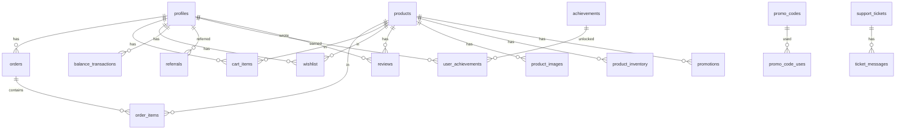

# 🗄️ Схема базы данных

Полная документация структуры базы данных Exodus DayZ Shop.

---

## 📑 Содержание

- [Обзор](#обзор)
- [ER-диаграмма](#er-диаграмма)
- [Основные таблицы](#основные-таблицы)
- [Таблицы заказов](#таблицы-заказов)
- [Таблицы платежей](#таблицы-платежей)
- [Таблицы геймификации](#таблицы-геймификации)
- [Таблицы коммуникаций](#таблицы-коммуникаций)
- [Таблицы аналитики](#таблицы-аналитики)
- [Таблицы администрирования](#таблицы-администрирования)
- [Функции и триггеры](#функции-и-триггеры)
- [RLS политики](#rls-политики)

---

## Обзор

| Категория | Количество таблиц |
|-----------|-------------------|
| Основные | 4 |
| Заказы | 3 |
| Платежи | 2 |
| Геймификация | 8 |
| Коммуникации | 6 |
| Аналитика | 5 |
| Администрирование | 7 |
| **Всего** | **35+** |

---

## ER-диаграмма



---

## Основные таблицы

### profiles

Профили пользователей (расширение auth.users).

| Колонка | Тип | Описание |
|---------|-----|----------|
| `id` | uuid | PK, ссылка на auth.users |
| `username` | text | Имя пользователя |
| `steam_id` | text | Steam ID |
| `discord_id` | text | Discord ID |
| `telegram_chat_id` | bigint | Telegram Chat ID |
| `balance` | numeric | Баланс аккаунта |
| `total_spent` | numeric | Всего потрачено |
| `is_veteran` | boolean | Статус ветерана |
| `is_banned` | boolean | Заблокирован |
| `banned_at` | timestamptz | Дата блокировки |
| `banned_reason` | text | Причина блокировки |
| `birthday` | date | День рождения |
| `avatar_url` | text | URL аватара |
| `referral_code` | text | Реферальный код |
| `referred_by` | text | Кем приглашён |
| `email_news_enabled` | boolean | Подписка на новости |
| `email_promotions_enabled` | boolean | Подписка на акции |
| `email_order_updates_enabled` | boolean | Уведомления о заказах |
| `created_at` | timestamptz | Дата создания |
| `updated_at` | timestamptz | Дата обновления |

### products

Товары магазина.

| Колонка | Тип | Описание |
|---------|-----|----------|
| `id` | text | PK, уникальный ID товара |
| `name` | text | Название |
| `description` | text | Описание |
| `price` | numeric | Цена |
| `image` | text | URL главного изображения |
| `category` | text | Категория |
| `created_at` | timestamptz | Дата создания |

### user_roles

Роли пользователей.

| Колонка | Тип | Описание |
|---------|-----|----------|
| `id` | uuid | PK |
| `user_id` | uuid | FK → profiles |
| `role` | app_role | Роль (enum) |

**Enum app_role:** `user`, `veteran`, `moderator`, `admin`, `super_admin`

### loyalty_levels

Уровни программы лояльности.

| Колонка | Тип | Описание |
|---------|-----|----------|
| `id` | uuid | PK |
| `name` | text | Название уровня |
| `min_spent` | numeric | Мин. сумма покупок |
| `discount_percent` | numeric | Скидка % |
| `cashback_percent` | numeric | Кэшбек % |
| `color` | text | Цвет бейджа |
| `icon` | text | Иконка |

---

## Таблицы заказов

### orders

Заказы пользователей.

| Колонка | Тип | Описание |
|---------|-----|----------|
| `id` | uuid | PK |
| `user_id` | uuid | FK → profiles |
| `steam_id` | text | Steam ID для доставки |
| `total_amount` | numeric | Сумма до скидки |
| `discount_amount` | numeric | Размер скидки |
| `final_amount` | numeric | Итоговая сумма |
| `payment_method` | text | Способ оплаты |
| `payment_status` | text | Статус оплаты |
| `created_at` | timestamptz | Дата создания |

**Статусы:** `pending`, `paid`, `cancelled`, `refunded`, `delivered`

### order_items

Позиции заказа.

| Колонка | Тип | Описание |
|---------|-----|----------|
| `id` | uuid | PK |
| `order_id` | uuid | FK → orders |
| `product_id` | text | ID товара |
| `product_name` | text | Название (snapshot) |
| `product_price` | numeric | Цена (snapshot) |
| `quantity` | integer | Количество |
| `created_at` | timestamptz | Дата создания |

### cart_items

Корзина пользователя.

| Колонка | Тип | Описание |
|---------|-----|----------|
| `id` | uuid | PK |
| `user_id` | uuid | FK → profiles |
| `product_id` | text | ID товара |
| `product_name` | text | Название |
| `product_price` | numeric | Цена |
| `quantity` | integer | Количество |
| `added_at` | timestamptz | Дата добавления |

---

## Таблицы платежей

### balance_transactions

Транзакции баланса.

| Колонка | Тип | Описание |
|---------|-----|----------|
| `id` | uuid | PK |
| `user_id` | uuid | FK → profiles |
| `amount` | numeric | Сумма |
| `type` | text | Тип операции |
| `description` | text | Описание |
| `payment_method` | text | Способ оплаты |
| `status` | text | Статус |
| `created_at` | timestamptz | Дата |

**Типы:** `topup`, `purchase`, `refund`, `bonus`, `cashback`, `referral`

### promo_codes

Промокоды.

| Колонка | Тип | Описание |
|---------|-----|----------|
| `id` | uuid | PK |
| `code` | text | Код (уникальный) |
| `discount_percent` | numeric | Скидка % |
| `is_active` | boolean | Активен |
| `valid_from` | timestamptz | Начало действия |
| `valid_until` | timestamptz | Конец действия |
| `max_uses` | integer | Макс. использований |
| `current_uses` | integer | Текущих использований |
| `min_order_amount` | numeric | Мин. сумма заказа |
| `created_at` | timestamptz | Дата создания |

### promo_code_uses

Использования промокодов.

| Колонка | Тип | Описание |
|---------|-----|----------|
| `id` | uuid | PK |
| `promo_code_id` | uuid | FK → promo_codes |
| `user_id` | uuid | FK → profiles |
| `order_id` | uuid | FK → orders |
| `used_at` | timestamptz | Дата использования |

---

## Таблицы геймификации

### achievements

Достижения.

| Колонка | Тип | Описание |
|---------|-----|----------|
| `id` | uuid | PK |
| `name` | text | Название |
| `description` | text | Описание |
| `icon` | text | Иконка |
| `requirement_type` | text | Тип условия |
| `requirement_value` | integer | Значение условия |
| `reward_balance` | numeric | Награда |
| `created_at` | timestamptz | Дата создания |

### user_achievements

Полученные достижения.

| Колонка | Тип | Описание |
|---------|-----|----------|
| `id` | uuid | PK |
| `user_id` | uuid | FK → profiles |
| `achievement_id` | uuid | FK → achievements |
| `unlocked_at` | timestamptz | Дата получения |

### referrals

Рефералы.

| Колонка | Тип | Описание |
|---------|-----|----------|
| `id` | uuid | PK |
| `referrer_id` | uuid | ID пригласившего |
| `referred_id` | uuid | ID приглашённого |
| `referral_code` | text | Использованный код |
| `bonus_given` | boolean | Бонус выдан |
| `created_at` | timestamptz | Дата |

### daily_rewards

Ежедневные награды.

| Колонка | Тип | Описание |
|---------|-----|----------|
| `id` | uuid | PK |
| `user_id` | uuid | FK → profiles |
| `last_claim` | date | Последний клейм |
| `streak` | integer | Серия дней |
| `total_claimed` | numeric | Всего получено |
| `created_at` | timestamptz | Дата создания |

### fortune_wheel_spins

Спины колеса фортуны.

| Колонка | Тип | Описание |
|---------|-----|----------|
| `id` | uuid | PK |
| `user_id` | uuid | FK → profiles |
| `prize_type` | text | Тип приза |
| `prize_value` | numeric | Значение приза |
| `spun_at` | timestamptz | Дата спина |

### wishlist

Список желаний.

| Колонка | Тип | Описание |
|---------|-----|----------|
| `id` | uuid | PK |
| `user_id` | uuid | FK → profiles |
| `product_id` | text | ID товара |
| `created_at` | timestamptz | Дата добавления |

### reviews

Отзывы о товарах.

| Колонка | Тип | Описание |
|---------|-----|----------|
| `id` | uuid | PK |
| `user_id` | uuid | FK → profiles |
| `product_id` | text | ID товара |
| `rating` | integer | Оценка (1-5) |
| `comment` | text | Комментарий |
| `created_at` | timestamptz | Дата создания |
| `updated_at` | timestamptz | Дата обновления |

### price_alerts

Алерты о снижении цены.

| Колонка | Тип | Описание |
|---------|-----|----------|
| `id` | uuid | PK |
| `user_id` | uuid | FK → profiles |
| `product_id` | text | ID товара |
| `target_price` | numeric | Целевая цена |
| `is_active` | boolean | Активен |
| `notified_at` | timestamptz | Дата уведомления |
| `created_at` | timestamptz | Дата создания |

---

## Таблицы коммуникаций

### notifications

Уведомления пользователей.

| Колонка | Тип | Описание |
|---------|-----|----------|
| `id` | uuid | PK |
| `user_id` | uuid | FK → profiles |
| `type` | text | Тип уведомления |
| `title` | text | Заголовок |
| `message` | text | Сообщение |
| `data` | jsonb | Дополнительные данные |
| `is_read` | boolean | Прочитано |
| `created_at` | timestamptz | Дата создания |

### support_tickets

Тикеты поддержки.

| Колонка | Тип | Описание |
|---------|-----|----------|
| `id` | uuid | PK |
| `user_id` | uuid | FK → profiles |
| `subject` | text | Тема |
| `status` | text | Статус |
| `priority` | text | Приоритет |
| `created_at` | timestamptz | Дата создания |
| `updated_at` | timestamptz | Дата обновления |
| `closed_at` | timestamptz | Дата закрытия |

### ticket_messages

Сообщения в тикетах.

| Колонка | Тип | Описание |
|---------|-----|----------|
| `id` | uuid | PK |
| `ticket_id` | uuid | FK → support_tickets |
| `sender_id` | uuid | ID отправителя |
| `message` | text | Сообщение |
| `is_admin` | boolean | От админа |
| `created_at` | timestamptz | Дата |

### broadcast_messages

Массовые рассылки.

| Колонка | Тип | Описание |
|---------|-----|----------|
| `id` | uuid | PK |
| `admin_id` | uuid | ID админа |
| `title` | text | Заголовок |
| `message` | text | Сообщение |
| `type` | text | Тип (email/push/both) |
| `target_audience` | text | Целевая аудитория |
| `status` | text | Статус |
| `sent_count` | integer | Отправлено |
| `failed_count` | integer | Ошибок |
| `created_at` | timestamptz | Дата создания |
| `sent_at` | timestamptz | Дата отправки |

### news_posts

Новости.

| Колонка | Тип | Описание |
|---------|-----|----------|
| `id` | uuid | PK |
| `author_id` | uuid | ID автора |
| `title` | text | Заголовок |
| `content` | text | Контент |
| `summary` | text | Краткое описание |
| `image` | text | URL изображения |
| `category` | text | Категория |
| `is_published` | boolean | Опубликовано |
| `is_pinned` | boolean | Закреплено |
| `published_at` | timestamptz | Дата публикации |
| `created_at` | timestamptz | Дата создания |
| `updated_at` | timestamptz | Дата обновления |

### telegram_users

Привязка Telegram.

| Колонка | Тип | Описание |
|---------|-----|----------|
| `id` | uuid | PK |
| `telegram_id` | bigint | Telegram ID |
| `telegram_username` | text | Username |
| `user_id` | uuid | FK → profiles |
| `verification_code` | text | Код верификации |
| `is_verified` | boolean | Верифицирован |
| `created_at` | timestamptz | Дата создания |

### push_subscriptions

Push подписки.

| Колонка | Тип | Описание |
|---------|-----|----------|
| `id` | uuid | PK |
| `user_id` | uuid | FK → profiles |
| `endpoint` | text | Push endpoint |
| `p256dh` | text | Ключ |
| `auth` | text | Auth |
| `created_at` | timestamptz | Дата создания |

---

## Таблицы аналитики

### product_views

Просмотры товаров.

| Колонка | Тип | Описание |
|---------|-----|----------|
| `id` | uuid | PK |
| `product_id` | text | ID товара |
| `user_id` | uuid | ID пользователя |
| `session_id` | text | ID сессии |
| `source` | text | Источник |
| `viewed_at` | timestamptz | Дата просмотра |

### product_clicks

Клики по товарам.

| Колонка | Тип | Описание |
|---------|-----|----------|
| `id` | uuid | PK |
| `product_id` | text | ID товара |
| `user_id` | uuid | ID пользователя |
| `action` | text | Тип действия |
| `created_at` | timestamptz | Дата |

### viewed_products

История просмотров пользователя.

| Колонка | Тип | Описание |
|---------|-----|----------|
| `id` | uuid | PK |
| `user_id` | uuid | FK → profiles |
| `product_id` | text | ID товара |
| `viewed_at` | timestamptz | Дата просмотра |

### price_history

История изменения цен.

| Колонка | Тип | Описание |
|---------|-----|----------|
| `id` | uuid | PK |
| `product_id` | text | ID товара |
| `old_price` | numeric | Старая цена |
| `new_price` | numeric | Новая цена |
| `changed_by` | uuid | Кто изменил |
| `changed_at` | timestamptz | Дата изменения |

### ab_tests / ab_test_results

A/B тестирование.

---

## Таблицы администрирования

### admin_settings

Настройки системы.

| Колонка | Тип | Описание |
|---------|-----|----------|
| `id` | uuid | PK |
| `key` | text | Ключ настройки |
| `value` | text | Значение |
| `description` | text | Описание |
| `is_encrypted` | boolean | Зашифровано |
| `created_at` | timestamptz | Дата создания |
| `updated_at` | timestamptz | Дата обновления |

### admin_audit_logs

Аудит действий админов.

| Колонка | Тип | Описание |
|---------|-----|----------|
| `id` | uuid | PK |
| `admin_id` | uuid | ID админа |
| `action` | text | Действие |
| `target_type` | text | Тип объекта |
| `target_id` | text | ID объекта |
| `old_value` | jsonb | Старое значение |
| `new_value` | jsonb | Новое значение |
| `ip_address` | text | IP адрес |
| `created_at` | timestamptz | Дата |

### cron_jobs

Cron задачи.

| Колонка | Тип | Описание |
|---------|-----|----------|
| `id` | uuid | PK |
| `name` | text | Название |
| `description` | text | Описание |
| `function_name` | text | Имя функции |
| `schedule` | text | Расписание (cron) |
| `is_enabled` | boolean | Включена |
| `last_run_at` | timestamptz | Последний запуск |
| `last_status` | text | Статус |
| `created_at` | timestamptz | Дата создания |
| `updated_at` | timestamptz | Дата обновления |

### Другие таблицы

- `flash_sales` — Флеш-распродажи
- `promotions` — Акции на товары
- `product_bundles` / `bundle_items` — Наборы товаров
- `homepage_banners` — Баннеры главной страницы
- `email_campaigns` — Email кампании
- `product_images` — Изображения товаров
- `product_inventory` — Инвентарь товаров
- `inventory_logs` — Логи инвентаря

---

## Функции и триггеры

### Database Functions

| Функция | Описание |
|---------|----------|
| `claim_daily_bonus()` | Получить ежедневный бонус |
| `calculate_daily_bonus(streak)` | Рассчитать размер бонуса |
| `spin_fortune_wheel()` | Крутить колесо фортуны |
| `can_spin_fortune_wheel()` | Проверить возможность спина |
| `check_rate_limit(...)` | Проверить rate limit |
| `has_role(user_id, role)` | Проверить роль пользователя |
| `safe_deduct_balance(...)` | Безопасное списание баланса |
| `deduct_balance(...)` | Списание баланса |

### Примеры вызова

```sql
-- Проверить роль
SELECT has_role('user-uuid', 'admin');

-- Получить ежедневный бонус
SELECT claim_daily_bonus();

-- Крутить колесо
SELECT spin_fortune_wheel();
```

---

## RLS политики

Все таблицы защищены Row Level Security (RLS).

### Примеры политик

```sql
-- Пользователь видит только свой профиль
CREATE POLICY "Users can view own profile" ON profiles
  FOR SELECT USING (auth.uid() = id);

-- Пользователь видит только свои заказы
CREATE POLICY "Users can view own orders" ON orders
  FOR SELECT USING (auth.uid() = user_id);

-- Товары видны всем
CREATE POLICY "Products are viewable by everyone" ON products
  FOR SELECT USING (true);

-- Только админы могут изменять товары
CREATE POLICY "Admins can modify products" ON products
  FOR ALL USING (has_role(auth.uid(), 'admin'));
```

---

## Индексы

Ключевые индексы для производительности:

```sql
-- Заказы по пользователю
CREATE INDEX idx_orders_user_id ON orders(user_id);

-- Товары по категории
CREATE INDEX idx_products_category ON products(category);

-- Транзакции по пользователю и дате
CREATE INDEX idx_balance_transactions_user_date 
  ON balance_transactions(user_id, created_at DESC);

-- Просмотры товаров
CREATE INDEX idx_product_views_product_id ON product_views(product_id);
```
