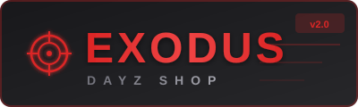

<p align="center">
  
</p>

<p align="center">
  
  
  
  
  
  
  
</p>

<p align="center">
  <a href="#-особенности">Особенности</a> •
  <a href="#-быстрый-старт">Быстрый старт</a> •
  <a href="#-документация">Документация</a> •
  <a href="#-скриншоты">Скриншоты</a> •
  <a href="#-лицензия">Лицензия</a>
</p>

---

# 🎮 Exodus DayZ Shop

> **Полнофункциональный интернет-магазин для игровых серверов DayZ** с продвинутой админ-панелью, системой платежей, геймификацией и интеграциями.

Современное веб-приложение, созданное с использованием React, TypeScript и Supabase. Поддерживает несколько платёжных систем, реферальную программу, систему достижений, уведомления через Email/Telegram/Push и многое другое.

---

## ✨ Особенности

### 🛒 Магазин
| Функция | Описание |
|---------|----------|
| **Каталог товаров** | Фильтрация, поиск, сортировка, пагинация |
| **Корзина** | Синхронизация между устройствами |
| **Список желаний** | Сохранение избранных товаров |
| **Сравнение** | Сравнение до 4 товаров |
| **Отзывы** | Рейтинги и комментарии |
| **История цен** | График изменения цены |
| **Алерты цен** | Уведомление при снижении |

### 👤 Личный кабинет
| Функция | Описание |
|---------|----------|
| **Профиль** | Настройки, аватар, статистика |
| **Steam** | Привязка аккаунта Steam |
| **Telegram** | Бот для уведомлений |
| **Discord** | Интеграция Discord |
| **История заказов** | Отслеживание статусов |
| **Баланс** | Пополнение и история |

### 🎮 Геймификация
| Функция | Описание |
|---------|----------|
| **Daily Reward** | Ежедневные награды со стриком |
| **Fortune Wheel** | Колесо фортуны с призами |
| **Достижения** | 20+ ачивок с наградами |
| **Рефералы** | Многоуровневая программа |
| **Лояльность** | Bronze → Silver → Gold → Platinum |
| **День рождения** | Персональные купоны |

### 💳 Платежи
| Система | Возможности |
|---------|-------------|
| **WayForPay** | Visa/MC, Apple Pay, Google Pay |
| **NOWPayments** | USDT, BTC, ETH и др. криптовалюты |
| **Баланс** | Оплата с внутреннего счёта |
| **Промокоды** | Гибкие условия и лимиты |
| **Flash Sales** | Распродажи с таймером |

### 🔧 Администрирование
| Раздел | Функции |
|--------|---------|
| **Dashboard** | Статистика, графики, аналитика |
| **Товары** | CRUD, изображения, категории, инвентарь |
| **Заказы** | Управление статусами, экспорт |
| **Пользователи** | Роли, баланс, баны |
| **Промо** | Промокоды, акции, баннеры, бандлы |
| **Рассылки** | Email кампании, broadcast |
| **Поддержка** | Тикеты с чатом |
| **A/B тесты** | Эксперименты |
| **Аудит** | Логи всех действий |
| **Cron** | Автоматизация задач |

### 📱 Технологии
- **PWA** — установка как приложение
- **Адаптивность** — все устройства
- **Темы** — тёмная/светлая
- **Realtime** — мгновенные обновления
- **SEO** — оптимизация

---

## 🚀 Быстрый старт

```bash
# Клонировать
git clone https://github.com/your-username/exodus-dayz-shop.git
cd exodus-dayz-shop

# Установить зависимости
npm install

# Запустить
npm run dev
```

Откройте http://localhost:8080

---

## 📊 Статистика проекта

| Метрика | Значение |
|---------|----------|
| **Страниц** | 17 |
| **Компонентов** | 90+ |
| **Таблиц БД** | 48 |
| **Edge Functions** | 19 |
| **Кастомных хуков** | 25 |
| **UI компонентов** | 50+ |
| **Методов оплаты** | 5 |
| **Языков** | RU/UK |

---

## 🏗️ Технологический стек

| Категория | Технологии |
|-----------|------------|
| **Frontend** | React 18.3, TypeScript 5.8 |
| **Сборка** | Vite 5.4, SWC |
| **Стили** | Tailwind CSS 3.4, CSS Variables |
| **UI** | shadcn/ui, Radix UI |
| **Роутинг** | React Router 6.30 |
| **Состояние** | TanStack Query 5.83 |
| **Формы** | React Hook Form, Zod |
| **Графики** | Recharts 2.15 |
| **Анимации** | Framer Motion |
| **Backend** | Supabase (PostgreSQL 15) |
| **Functions** | Deno (Edge Functions) |
| **Тесты** | Vitest, Testing Library |
| **CI/CD** | GitHub Actions |

---

## 📁 Структура проекта

```
exodus-dayz-shop/
├── .github/
│   ├── workflows/         # CI/CD pipelines
│   └── dependabot.yml     # Auto-updates
├── public/
│   ├── banners/           # Промо-баннеры
│   ├── workshop/          # Изображения товаров
│   ├── logo.svg           # Логотип
│   └── manifest.json      # PWA манифест
├── scripts/
│   ├── database-dump.sql  # Дамп схемы БД
│   ├── seed-data.sql      # Тестовые данные
│   └── README.md          # Инструкции
├── src/
│   ├── assets/            # Статические ресурсы
│   ├── components/
│   │   ├── admin/         # Компоненты админки (25+)
│   │   ├── auth/          # Авторизация
│   │   ├── cart/          # Корзина
│   │   └── ui/            # shadcn/ui (50+)
│   ├── contexts/          # React контексты
│   ├── data/              # Статические данные
│   ├── hooks/             # Кастомные хуки (25)
│   ├── integrations/      # Supabase клиент
│   ├── lib/               # Утилиты
│   ├── pages/             # Страницы (17)
│   └── test/              # Тесты
├── supabase/
│   ├── functions/         # Edge Functions (19)
│   └── migrations/        # Миграции БД (34)
├── Dockerfile             # Docker образ
├── docker-compose.yml     # Docker Compose
├── nginx.conf             # Nginx конфиг
└── vitest.config.ts       # Конфиг тестов
```

---

## 📚 Документация

| Документ | Описание |
|----------|----------|
| [**INSTALLATION.md**](./INSTALLATION.md) | Полная инструкция по установке |
| [**FEATURES.md**](./FEATURES.md) | Описание всех возможностей |
| [**DATABASE.md**](./DATABASE.md) | Схема базы данных |
| [**API.md**](./API.md) | Документация Edge Functions |
| [**ARCHITECTURE.md**](./ARCHITECTURE.md) | Архитектура проекта |
| [**DEPLOYMENT.md**](./DEPLOYMENT.md) | Руководство по деплою |
| [**CONTRIBUTING.md**](./CONTRIBUTING.md) | Для контрибьюторов |
| [**CHANGELOG.md**](./CHANGELOG.md) | История изменений |

---

## 🛠️ Скрипты

| Команда | Описание |
|---------|----------|
| `npm run dev` | Запуск dev-сервера |
| `npm run build` | Сборка для production |
| `npm run preview` | Предпросмотр сборки |
| `npm run lint` | Проверка ESLint |
| `npm run test` | Запуск тестов |
| `npm run test:coverage` | Тесты с coverage |

---

## 🐳 Docker

```bash
# Production build
docker-compose up -d app

# Development
docker-compose --profile dev up dev

# Rebuild
docker-compose up -d --build
```

---

## 🔐 Безопасность

- ✅ **RLS Policies** — Row Level Security на всех таблицах
- ✅ **Rate Limiting** — защита от спама
- ✅ **Input Validation** — Zod схемы
- ✅ **CORS** — настроенные заголовки
- ✅ **Audit Logs** — логирование действий
- ✅ **Role-Based Access** — разграничение прав

---

## 🤝 Вклад в проект

См. [CONTRIBUTING.md](./CONTRIBUTING.md)

1. Fork репозитория
2. Создайте ветку (`git checkout -b feature/amazing`)
3. Commit изменений (`git commit -m 'Add amazing feature'`)
4. Push (`git push origin feature/amazing`)
5. Откройте Pull Request

---

## 📄 Лицензия

MIT License — см. [LICENSE](./LICENSE)

---

<p align="center">
  <b>Сделано с ❤️ для сообщества DayZ</b>
</p>

<p align="center">
  <a href="https://github.com/your-username/exodus-dayz-shop/issues">Сообщить о баге</a> •
  <a href="https://github.com/your-username/exodus-dayz-shop/discussions">Обсуждения</a>
</p>
